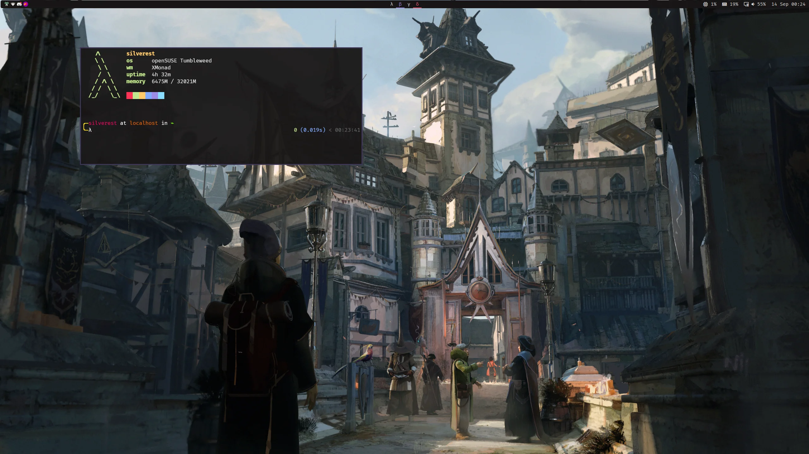
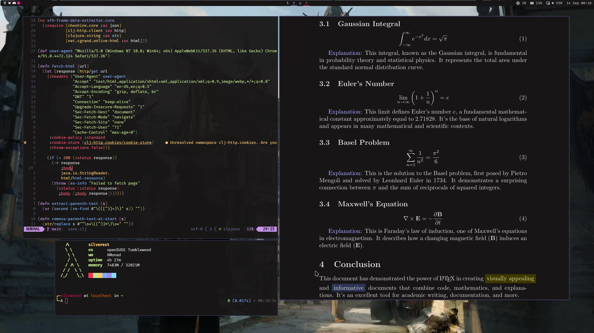
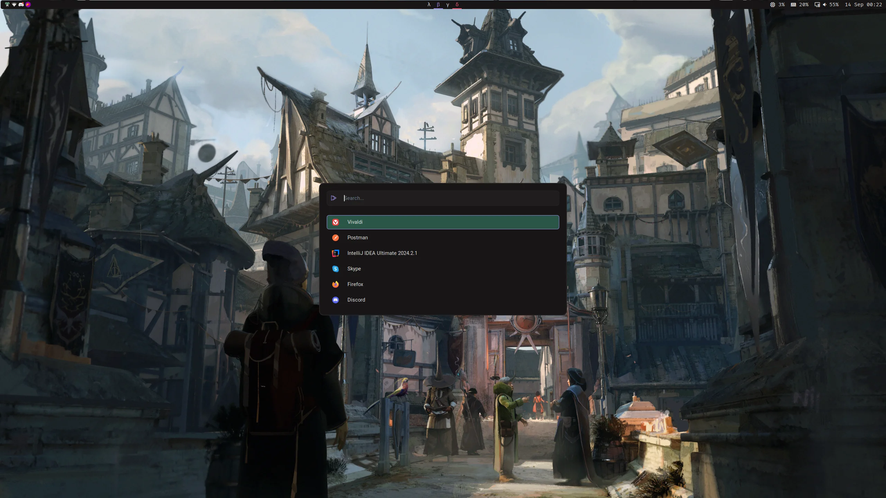

# dotFiles

### Preview





Credit:

Georgi Karadenizov : 

### Tools

| Tools | Software |
| --- | --- |
| WM | [Hyprland](.config/hypr) |
| StatusBar | [Waybar](.config/waybar) |
| Terminal | [Kitty](.config/kitty) |
| Shell | [fish](.config/fish) |
| Editor | [Neovim](.config/nvim) |
| File Manager | [Thunar](.config/gtk3.0) |
| Launcher | [rofi](.config/rofi/) |

### Fixes

GRUB config for Huawei Matebook 14D AMD Ryzen 2500U to random freezes issues

```
GRUB_CMDLINE_LINUX_DEFAULT="quiet idle=nomwait acpi_backlight=video apparmor=1"
```
