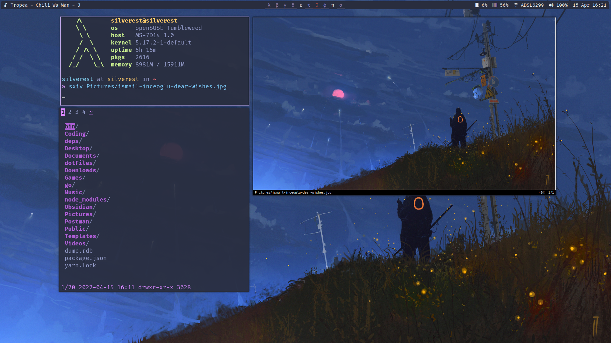

# dotFiles

### Preview 




[Preview1](./Imgs/preview1.png) [Preview2](./Imgs/preview2.png) [Preview3](./Imgs/preview3) [Preview4](./Imgs/preview4.png)

Credit:
[The Witcher Dear Guest - Ismail Inceoglu](https://www.artstation.com/artwork/BL919)
I don't know the rest will update once i find them.

### Tools

| Tools | Software |
| --- | --- |
| WM | [xmonad](.xmonad/config.hs) |
| StatusBar | [Polybar](.config/polybar) |
| Terminal | [Kitty](.config/kitty) |
| Editor | [Neovim](.config/nvim) |
| File Manager | [nnn](.config/nnn) |


### Fixes

GRUB config for Huawei Matebook 14D AMD Ryzen 2500U to random freezes issues

```
GRUB_CMDLINE_LINUX_DEFAULT="quiet idle=nomwait acpi_backlight=video apparmor=1"
```

### Todo

- [ ] Move XMonad to stack instead of cabal
- [ ] Make install scripts

