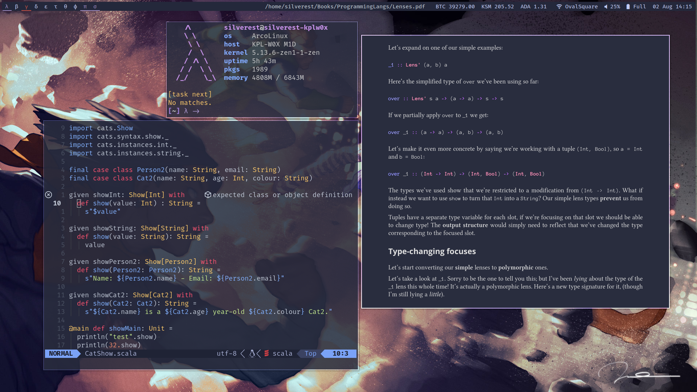

# dotFiles

### Preview 




Credit:

[ Dear wishes - Ismail Inceoglu](https://www.artstation.com/artwork/X13Q3Y)

### Tools

| Tools | Software |
| --- | --- |
| WM | [xmonad](.xmonad) |
| Compositor | [picom](.xmonad/scripts/picom.conf) |
| StatusBar | [Polybar](.config/polybar) |
| Terminal | [Kitty](.config/kitty) |
| Shell | [fish](.config/fish) |
| Editor | [Neovim](.config/nvim) |
| File Manager | [nnn](.config/nnn) |
| Notifications | [dunst](.config/dunst) |
| Pdf Reader | [zathura](.config/zathura/) |
| Launcher | [rofi](.config/rofi/) |

### Fixes

GRUB config for Huawei Matebook 14D AMD Ryzen 2500U to random freezes issues

```
GRUB_CMDLINE_LINUX_DEFAULT="quiet idle=nomwait acpi_backlight=video apparmor=1"
```

### Todo

- Add script to install fonts
